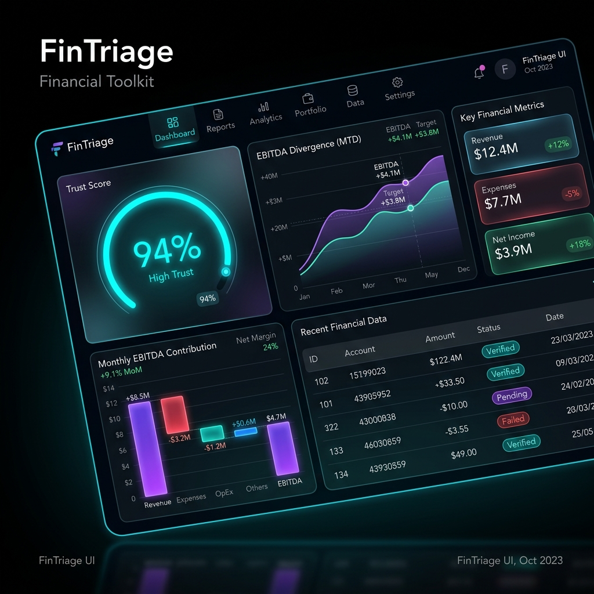
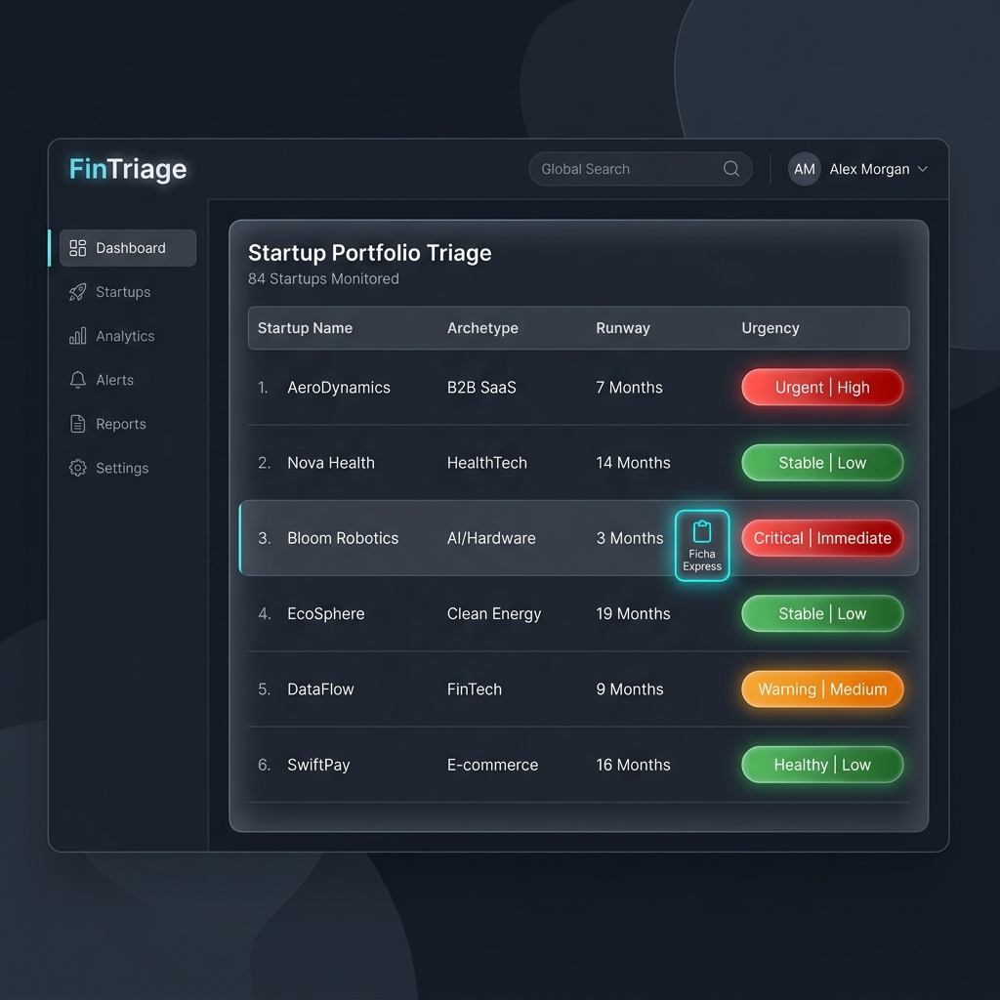

# FinTriage — CFO & Portfolio Toolkit

> **Versión Actual:** `v1.4.0` · Plataforma Local-First de Triage y Diagnóstico Financiero para Startups y Pymes.

[](https://fin-triage.vercel.app/)
[](https://www.linkedin.com/in/borjafelixrojas/)
[](LICENSE)

**FinTriage** es una plataforma profesional de análisis, saneamiento y triage financiero client-side, diseñada especialmente para CFOs externos, consultores independientes, asesores y fundadores de startups. Esta herramienta automatiza la ingesta de libros contables del Plan General Contable (PGC) español, diagnosticando la consistencia de los apuntes, recalculando márgenes analíticos, proyectando escenarios de caja y ofreciendo un panel de control multicompañía para priorizar carteras enteras en tiempo real.

---

## Vista Previa de la Interfaz (Dark Glassmorphism UI)

La aplicación implementa una estética de alta fidelidad inmersiva basada en **Dark Glassmorphism**, ofreciendo paneles interactivos fluidos y micro-animaciones reactivas sin sobrecargar el navegador.

```carousel

<!-- slide -->

```

---

## 1. El Problema que Resuelve

Los fundadores y consultores financieros se enfrentan a menudo a contabilidades rígidas, desordenadas o desactualizadas de múltiples startups de manera simultánea. Extraer información de gestión estratégica y KPIs de un libro diario en Excel (`.xlsx`) requiere horas de reordenamiento manual propenso a errores.

**FinTriage** resuelve esto de forma instantánea:
*   **Decodifica el Caos Contable**: Lee diarios contables en su formato nativo de exportación, detecta descuadres y evalúa la fiabilidad del dato mediante un **Trust Score (0-100)** basado en reglas deterministas.
*   **Normaliza el EBITDA**: Identifica, periodifica y prorratea picos atípicos de gasto o ingresos (devengos) para simular el EBITDA orgánico real de la compañía sin mutar los apuntes base.
*   **Triage Multicompañía Inteligente**: Permite cargar y supervisar de 3 a 4 startups de forma simultánea, detectando bloqueadores clave de auditoría previa (préstamos a socios en cuenta 551, deudas públicas en el Grupo 47) y asignando una ruta operativa inmediata para cada caso.

---

## 2. Enfoque Local-First: Confidencialidad y Procesamiento en Navegador

FinTriage opera bajo una filosofía estrictamente **Local-First (Zero-Server)**. 
*   **Procesamiento Local**: El 100% de la carga, parseo, cálculo, visualización y exportación de datos financieros se ejecuta localmente en el navegador del usuario.
*   **Sin Envío a Servidores**: Tus datos financieros confidenciales no se transmiten a servidores externos ni se almacenan en bases de datos en la nube. La confidencialidad queda resguardada por diseño al operar íntegramente del lado del cliente, evitando cualquier tipo de recopilación o transferencia externa involuntaria.

---

## 3. Stack y Arquitectura General

La aplicación está diseñada como una Single Page Application (SPA) ultraligera de alto rendimiento, optimizada para cargarse instantáneamente sin dependencias pesadas:

*   **Core**: HTML5 Semántico y Vanilla Javascript (ES6+).
*   **Reactividad**: Motor reactivo nativo implementado con **Javascript Deep Proxies** sobre el estado global (`STATE`), coordinando automáticamente vistas y flujos.
*   **Estética Visual**: Vanilla CSS con diseño premium de alta fidelidad basado en **Dark Glassmorphism** (fondos translúcidos con `backdrop-filter: blur`, gradientes sutiles y micro-animaciones reactivas).
*   **Procesamiento de Libros**: Integración con **SheetJS** para ingesta ultrarrápida de libros diarios grandes en formato `.xlsx`.
*   **Gráficos**: Generación nativa de gráficos estadísticos, de barras y de cascada interactivos mediante SVG manipulados dinámicamente.
*   **Exportación**: Integración con **html2pdf.js** para reportes con portada ejecutiva y exportaciones vivas a Excel con fórmulas de cálculo dinámicas.

---

## 4. Estructura de Módulos

| Módulo | Archivo | Responsabilidad / Función |
|--------|---------|---------------------------|
| **Store** | `store.js` | Motor de Estado Reactivo centralizado (Deep Proxy) y patrón Observer. |
| **Parser** | `parser.js` | Ingesta Excel (.xlsx), saneamiento temporal contable y anomalías de nivel 1. |
| **Analyzer** | `analyzer.js` | Motor de reglas declarativo, Trust Score, clasificación a PyG analítica y motor de devengos. |
| **Cartera** | `cartera.js` | Triage tridimensional multicompañía, semáforos de urgencia y routing por perfiles. |
| **Defensa** | `defensa.js` | Cockpit de supervivencia de caja, DSO/DPO reales y plan de choque interactivo de 100 días. |
| **Scorer** | `scorer.js` | Motor de elegibilidad multicriterio para 8 líneas de financiación (ENISA, CDTI Neotec, ICO Crecimiento, ICO Verde, SGR/CERSA, Torres Quevedo, EIC Accelerator y MicroBank). |
| **Forecaster** | `forecaster.js` | Proyección estadística a 12 meses con escenarios (optimista, base, pesimista). |
| **Session** | `session.js` | Persistencia unificada local de archivos de sesión en formato `.fintriage` y `.aptki`. |
| **Narrative** | `narrative.js` | Motor de análisis textual para disclaimers y comentarios de EBITDA. |
| **Checklist** | `checklist.js` | Framework interactivo "Filtro Día 1" con biblioteca de reglas y localStorage. |
| **Exporter** | `exporter.js` | Exportaciones dinámicas con fórmulas a Excel y PDFs con portada interactiva. |
| **App** | `app.js` | Controlador SPA principal, ruteador de vistas, manipulación del DOM y Audit Trail. |

---

## 5. Formato de Persistencia Dual `.fintriage`

El sistema interactúa de forma transparente con dos esquemas locales basados en JSON:

*   **Modo Individual (`mode: "single"`)**: Almacena el ledger parseado de una startup, mapeos contables personalizados modificados por el consultor, periodificaciones aprobadas, checklist, audit trail e inputs de simulaciones de caja en un archivo `.fintriage`.
*   **Modo Cartera (`mode: "portfolio"`)**: Consolida la lista completa de startups en un único archivo. Cada startup en el array encapsula su nombre, arquetipo y su payload de `sessionData` individual completo, permitiendo la rehidratación profunda al transicionar de vista.
*   **Compatibilidad de Lectura**: FinTriage mantiene retrocompatibilidad total para leer archivos históricos `.aptki`. El sistema detecta el formato al arrastrarlo y migra la sesión de forma transparente.

---

## 6. Motor Scorer Multilínea y Perfil Empresarial Ampliado

Para ofrecer una alternativa superior y totalmente diferenciada de las herramientas tradicionales (como APTKI), FinTriage v1.4.0 incorpora un **Perfil Empresarial Ampliado** en el Paso 2 (Contexto Contable) y un **Motor Scorer Modular** que analiza y califica la elegibilidad de la compañía frente a **8 líneas financieras públicas y bancarias de alto impacto**:

1. **ENISA (Jóvenes Emprendedores, Emprendedores y Crecimiento)**: Evaluación clásica de Fondos Propios y rating financiero.
2. **CDTI Neotec**: Diagnóstico estricto de empresa innovadora y test de crisis UE.
3. **ICO Crecimiento**: Línea de préstamo bancario con garantía ICO para financiar inversiones y circulante a medio-largo plazo.
4. **ICO Verde (Fase 1.5)**: Financiamiento verde enfocado en mitigación ambiental (línea disponible de forma transitoria hasta el 31 de agosto de 2026).
5. **SGR / CERSA**: Evaluación de avales financieros a nivel de Sociedades de Garantía Recíproca, con enrutado inteligente por Comunidad Autónoma (p. ej., Avalis en Cataluña, Avalmadrid en Madrid, etc.).
6. **Torres Quevedo**: Subvenciones para la contratación de doctores en I+D.
7. **EIC Accelerator**: Altamente competitiva financiación europea mixta (grant + equity) para disrupción profunda de base tecnológica, con advertencias de uso único si ya se ha concedido previamente.
8. **MicroBank**: Microcréditos ágiles de hasta 30.000 € (o 50.000 € en convenios especiales) para microempresas y autónomos sin necesidad de aval real.

### Perfil Empresarial Ampliado (100% Retrocompatible)
El formulario del Paso 2 recoge de forma fluida y no intrusiva los siguientes calificadores cualitativos y cuantitativos que alimentan este motor de scoring:
* **Constitución y Geografía**: Fecha de constitución y Comunidad Autónoma fiscal (para enrutado regional SGR).
* **Operaciones**: Empleados, auditoría de cuentas, porcentaje de ventas al exterior e inversiones procedentes del extranjero.
* **I+D y Tecnología**: Nivel de Madurez Tecnológica (TRL 1-9), actividad explícita en I+D, intención de contratar doctores y posesión de Propiedad Intelectual propia.
* **Historial y Sostenibilidad**: Si se ha concedido previamente ayuda EIC Accelerator y si el proyecto califica como "proyecto verde" (economía circular, energías renovables, descarbonización).

> [!NOTE]
> **Garantía de Retrocompatibilidad:** Si se carga una sesión antigua `.fintriage` o `.aptki` donde no estén informados estos campos, el motor de rehidratación defensiva los inicializa a `null` o `false` para que los evaluadores de `scorer.js` calculen el scoring base sin arrojar errores ni penalizaciones redundantes.

---

## 7. Flujo de Uso Básico

```
[Libro Diario .xlsx] o [Sesión .fintriage / .aptki]
                        │
                        ▼
                [session.js] (Detección automática de formato)
                 /        \
                 /          \
          (Single Mode)    (Portfolio Mode)
              /              \
             ▼                ▼
     [Dashboard Individual] ──► [Tabla de Control de Cartera]
      - Scoring Multilínea Ampliado - Filtros por Ruta e Hitos
      - Cockpit de Defensa       - Copiado de Ficha Express 📋
      - Proyecciones 12M         - Transición con 1-click a Dashboard
```

1.  **Ingesta de Datos**: Arrastre un libro diario contable `.xlsx` o cargue uno o varios archivos de sesión `.fintriage`.
2.  **Triage de Cartera**: Controle de un vistazo el panel multicompañía, visualizando el semáforo de urgencia, runway, problemas principales y bloqueadores de cada startup.
3.  **Ficha Express**: Haga clic en el botón de portapapeles `📋` en cualquier fila de la tabla para copiar y comunicar la ficha sintética de triage inmediatamente a los equipos.
4.  **Análisis Profundo (Dashboard)**: Entre al detalle de cualquier compañía para reclasificar cuentas, aplicar periodificaciones contables, completar el Checklist Día 1 y simular planes de supervivencia de caja.
5.  **Exportación y Cierre**: Guarde la sesión de forma individual o agregada en formato `.fintriage` para retomar el trabajo sin fricciones.

---

## 8. Despliegue en Vercel (Sitio Estático)

Al ser una aplicación 100% client-side sin backend ni base de datos, el despliegue es sumamente sencillo e inmediato:

### Opción 1: Despliegue Directo de 1-Click con Vercel CLI
Si tienes Vercel CLI instalado en tu terminal:
```bash
# 1. Abre la terminal en el directorio raíz de la herramienta
# 2. Ejecuta el comando de despliegue
vercel
```
Sigue las preguntas interactivas en pantalla y en menos de 30 segundos tendrás un enlace de producción HTTPS listo.

### Opción 2: Despliegue mediante GitHub
1. Sube el proyecto a tu propio repositorio de GitHub.
2. Inicia sesión en [Vercel Dashboard](https://vercel.com).
3. Haz clic en **"Add New"** > **"Project"** e importa tu repositorio.
4. Vercel detectará que es un proyecto estático puro. Haz clic en **"Deploy"** sin realizar ninguna configuración adicional de compilación.

---

## 9. Licencia y Confidencialidad

*   **Licencia**: Licencia MIT. Libre de usar, modificar y distribuir de forma personal o comercial.
*   **Garantía**: Esta herramienta se provee "tal cual", sin garantías de ningún tipo. Los diagnósticos financieros, tributarios y de elegibilidad pública son orientativos y de carácter instrumental; no constituyen asesoría fiscal, legal o de inversión formal.

---

## 10. Próximos Grandes Hitos (Roadmap)

La arquitectura de **FinTriage** ya consolida con éxito las **Fases 1 a 9** de su desarrollo estratégico (incluyendo el motor reactivo por Deep Proxies, análisis dinámico del PGC, el cockpit de supervivencia a 100 días, la tabla de cartera de alto impacto y la flamante **Expansión Multilínea v1.4.0**). Puedes consultar el historial técnico detallado de cada fase en el [CHANGELOG.md](CHANGELOG.md).

De cara a las próximas actualizaciones, el roadmap contempla:

1. **Copiloto IA Financiero (Integración LLM)**: Incorporación de un motor de lenguaje local o mediante API de alta seguridad para interpretar automáticamente la Ficha de Triage, evaluando la elegibilidad del scoring ampliado y redactando de forma inteligente argumentarios de inversión y análisis cualitativos personalizados para cada línea (ICO, SGR, Torres Quevedo, etc.).
2. **Modelo Avanzado de Solvencia y CIRBE**: Incorporación de reglas de scoring basadas en el rating de solvencia contable y análisis de capacidad de servicio de la deuda bancaria española (CIRBE) para robustecer la evaluación de líneas ICO y MicroBank.
3. **Módulo de Conciliación Bancaria Automática (PSD2)**: Conexión segura e ingesta de movimientos bancarios en tiempo real para contrastar y verificar la conciliación de caja frente al diario.

---

## 11. Identidad Visual y Logotipos

Los recursos gráficos oficiales de FinTriage están disponibles en la carpeta [assets/](assets/) e incluyen las siguientes variantes:
*   `logo-wordmark.svg`: Wordmark tipográfico limpio y minimalista (diseño recomendado).
*   `logo-dark.svg`: Logotipo optimizado para interfaces oscuras (dark mode).
*   `logo-light.svg`: Logotipo optimizado para interfaces claras (light mode).
*   `favicon-icon.svg`: Isotipo / favicon compacto para navegación web.
