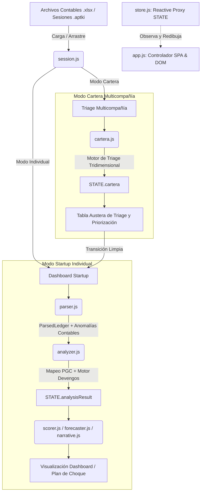

# Arquitectura de APTKI Workstation

APTKI Workstation es una herramienta client-side modular e interactiva diseñada para que consultores senior de APTKI realicen el saneamiento, periodificación, diagnóstico y triage estratégico de múltiples compañías (carteras) o de startups individuales a partir de sus libros diarios en formato PGC español (.xlsx).

El sistema sigue una arquitectura de flujo unidireccional y reactividad nativa basada en Proxies de Javascript, asegurando la inmutabilidad y la persistencia local de los datos.

---

## Estructura General del Sistema

El flujo del pipeline financiero y de triage está dividido en dos grandes modos de operación:
1. **Modo Startup Individual**: Ingesta un libro diario, detecta anomalías, permite correcciones (mapeos contables y periodificaciones de devengo) y produce un dashboard financiero interactivo con proyecciones y planes de choque.
2. **Modo Cartera Multicompañía**: Permite la ingesta masiva de múltiples archivos `.aptki` para consolidar un panel ejecutivo que prioriza empresas por gravedad de caja, diagnostica bloqueadores de due diligence y enruta automáticamente las startups a los departamentos adecuados (CFO, Fundraising, Financiación Pública/Bancaria, Gestoría).

---

## Componentes y Módulos Core

### 1. Motor de Estado Global Reactivo (`js/store.js`)
*   **Patrón**: Deep Proxy & Pub/Sub (Observer).
*   **Función**: Centraliza la reactividad de la aplicación. Cualquier modificación sobre el objeto global `STATE` dispara automáticamente a los observadores registrados, lo que permite redibujar la interfaz de forma selectiva y en tiempo real.
*   **Invariante**: Evita dependencias de frameworks externos (React, Vue) manteniendo un rendimiento óptimo de 100% en el cliente.

### 2. Gestor de Persistencia y Soporte Dual (`js/session.js`)
*   **Soporte**: Opera de forma transparente con dos esquemas del formato unificado `.aptki`:
    *   `mode: "single"`: Estructura individual que guarda ledger parsed, mapeos personalizados, entradas de scoring, periodificaciones aprobadas, checklist Día 1, audit trail e inputs del cockpit de defensa.
    *   `mode: "portfolio"`: Estructura agregada que empaqueta las startups cargadas junto con sus metadatos y sessionData individuales completos.
*   **Rehidratación**: Al importar una sesión consolidada, regenera automáticamente el triage de todas las empresas y las renderiza en la tabla de priorización.

### 3. Motor de Triage Contable y Routing (`js/cartera.js`)
*   **Problema Principal (Foco)**: Evalúa el estado de salud financiera en base a umbrales estrictos de Runway, Deuda Pública (Grupo 47 neto), Préstamos a Socios (Cta 551/552) y Circulante (DSO/DPO agregados por prefijo).
*   **Bloqueadores de Financiación**: Determina si existen contingencias que impiden iniciar expedientes de financiación (Trust Score < 65%, Deuda Pública > 3000€, Cuenta corriente con socios 551/550 > 3000€).
*   **Routing Inteligente**: Asigna a cada startup una ruta sugerida (CFO, Fundraising, Financiación Pública, Financiación Bancaria, Gestoría/Orden Contable) y propone la acción correctiva inmediata.
*   **Score de Prioridad**: Calcula una métrica de 0 a 100 y asigna un semáforo de urgencia (🔴 Rojo, 🟡 Amarillo, 🟢 Verde) para que el consultor focalice su atención.

### 4. Módulo de Supervivencia y Defensa de Caja (`js/defensa.js`)
*   **DSO y DPO Reales**: Corrige el signo de las cuentas y agrega por prefijo (43 para Clientes deudor, 40 para Proveedores acreedor) para calcular correctamente la velocidad de rotación.
*   **Plan de Choque**: Proporciona un checklist accionable de 10 medidas críticas para recortar burn rate y defender caja si el Runway es crítico (< 4 meses).
*   **Simulador de Estrategia**: Modela el impacto directo de mejoras de circulante (cobros y pagos) y reducción de gastos en el Runway proyectado.

---

## Reglas Arquitectónicas y Directrices de Desarrollo

1. **Local-First y Confidencialidad**: Todo el procesamiento se realiza en el navegador web del usuario. No existe base de datos centralizada ni servidor de backend. Los libros diarios y datos analíticos no se transmiten a ninguna red externa.
2. **Inmutabilidad en la Cadena de Datos**: Los módulos de análisis (`analyzer.js`, `cartera.js`, `defensa.js`) no alteran el estado original (`ParsedLedger`). Producen objetos nuevos e independientes (`AnalysisResult` / `TriageResult`) que se inyectan en el store reactivo.
3. **Robustez y Seguridad Contable**:
    *   **Trust Score**: Evalúa la coherencia del libro contable penalizando descuadres, asientos sin partida doble correcta, cuentas puente excesivamente cargadas (555) y anomalías temporales.
    *   **Umbrales Críticos**: Limita la elegibilidad de financiación y el forecast si el Trust Score es bajo o si existen anomalías de nivel crítico (desbalances de asiento).
4. **Controlador SPA Aislado del DOM (`js/app.js`)**: Encargado de la lógica de enrutamiento visual, renderizado de las diferentes pantallas (Carga, Dashboard, Defensa, Cartera) y la centralización del **Audit Trail** (trazabilidad de auditoría que registra cada acción del consultor).
