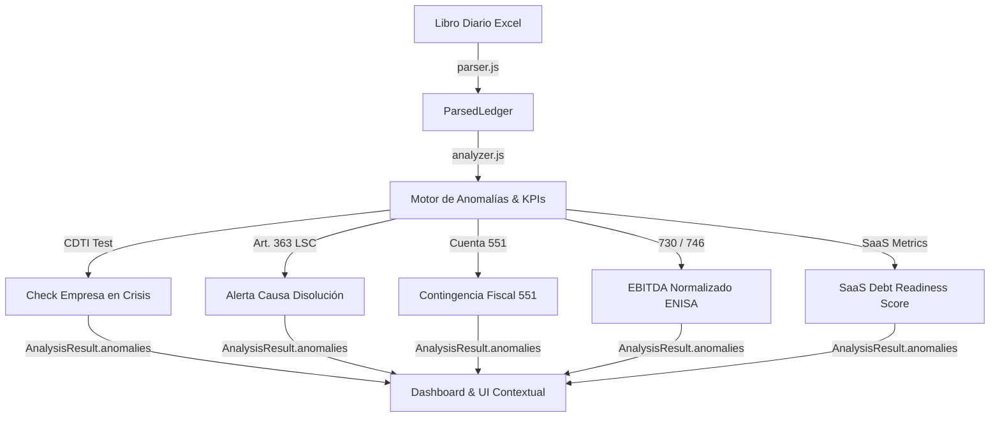

# Revisión Conceptual y Mapa de Convergencia Técnica: FinTriage

Este documento detalla el **análisis conceptual profundo** y el **plano de integración técnica (blueprint)** para incorporar las cuatro nuevas líneas de investigación financiera en la arquitectura determinista de la FinTriage.

---

## 1. Introducción y Contexto Estratégico

Las cuatro investigaciones aportadas representan un salto cualitativo excepcional para FinTriage. Pasan de la contabilidad plana al **asesoramiento estratégico de nivel CFO (Chief Financial Officer)** para startups tecnológicas en el ecosistema español. El rigor, la precisión en los códigos de cuenta y la alineación con la legislación vigente (Ley 28/2022 de Startups, Ley de Sociedades de Capital, Ley del Impuesto sobre Sociedades y Reglamentos de la UE) son extraordinarios.

A continuación, se presenta la revisión conceptual detallada con las "gafas de FinTriage" (buscando robustez analítica, mitigación de riesgos y automatización limpia) y, posteriormente, el diseño técnico de su convergencia con el código del producto.

---

## 2. Parte I: Revisión Conceptual (La Mirada del CFO Auditor)

### Documento 1: Certificación de Startups por ENISA – Guía Estratégica
* **Diagnóstico de Coherencia:** El análisis del marco cuantitativo y cualitativo es impecable. El uso de la doble vía (acreditación automática vs. discrecional) y la clasificación de los beneficios fiscales (IS al 15%, aplazamiento sin intereses ni garantías, exención de stock options a 50k y bonificación RETA) es exacta.
* **Matices Clave a Reforzar:**
  1. **El desfase temporal en el Registro Mercantil:** ENISA evalúa la situación con base en escrituras e inscripciones reales. Si una startup cierra una ronda de inversión de 300.000 € en diciembre y solicita ENISA en enero, pero la ampliación de capital y su correspondiente *Prima de Emisión* no están inscritas en el Registro Mercantil (trámite que suele tardar de 15 a 45 días), ENISA considerará que la empresa **no dispone de esos fondos propios**. El CFO debe planificar el envío de la solicitud *después* de obtener la certificación de inscripción registral.
  2. **El principio DNSH (Do No Significant Harm):** Además de los requisitos mercantiles y fiscales, la Taxonomía Verde Europea es una barrera dura. Startups en sectores de logística intensiva, minería de datos o procesamiento en la nube sin políticas de eficiencia energética pueden ser rechazadas discrecionalmente.
  3. **MVP vs. Balance "Virgen":** El analista de ENISA penaliza severamente el oportunismo de solicitar la certificación con una sociedad constituida hace un mes donde el balance es capital social 3.000 € en banco y sin gastos de explotación. Se requiere actividad real (desarrollo tecnológico en curso o tracción incipiente).

### Documento 2: Modelo de Debt Capacity (Capacidad de Deuda)
* **Diagnóstico de Coherencia:** El modelo de simulación de mix óptimo de financiación ilustra a la perfección el peligro de un apalancamiento excesivo en fases tempranas. La regla de paridad de fondos propios de ENISA ($FP \ge \text{Préstamo}$) es la regla de oro.
* **Matices Clave a Reforzar:**
  1. **La paradoja de los Préstamos Participativos de Socios:** Contablemente, a efectos de la Ley de Sociedades de Capital (Art. 363 LSC), un préstamo participativo otorgado por un socio computa como Patrimonio Neto para evitar la disolución. Sin embargo, **para ENISA y para el test de CDTI, este préstamo NO computa como fondos propios elegibles** a menos que se capitalice formalmente mediante ampliación o aportación a la cuenta 118.
  2. **El test CDTI de "Empresa en Crisis" vs. Causa de Disolución:** Esta es una distinción crítica que confunde al 90% de los CFOs:
     * Una SL está a salvo de la **disolución legal** (Art. 363.1.e LSC) si $PN > CS/2$.
     * Sin embargo, esa misma SL puede ser descalificada por el CDTI por ser **"Empresa en Crisis"** según el Reglamento de la UE 651/2014 si $(PN - CS - \text{Pérdidas acumuladas}) < -CS/2$.
     * *Ejemplo:* Si una empresa tiene Capital Social ($CS$) de 100k, reservas de 20k y pérdidas acumuladas de 70k, su $PN$ es 50k. Cumple la LSC (50k $\ge$ 50k), pero para el CDTI la fórmula da: $(50k - 100k - (-70k \text{ en valor absoluto})) = -120k$, que es menor a $-50k$ (la mitad del capital). ¡Estaría en causa de crisis CDTI y sería rechazada automáticamente!
  3. **Venture Debt Warrants Dilution:** Los warrants de Venture Debt (usualmente del 10% al 25% del principal) no son deuda gratis; actúan como una dilución diferida. El CFO debe modelar el "diluted share count" asumiendo que el acreedor ejecutará los warrants en la valoración de la siguiente ronda de inversión, lo que en escenarios de "down-rounds" puede causar estragos.

### Documento 3: Análisis Fiscal de la Cuenta Contable 551
* **Diagnóstico de Coherencia:** La estructura del riesgo fiscal de la cuenta 551 es un tratado magistral de fiscalidad operativa. La distinción entre saldo deudor (presunción de dividendo encubierto) y acreedor (préstamo vinculado implícito) es de obligado conocimiento para cualquier CFO en España.
* **Matices Clave a Reforzar:**
  1. **La regla de proporcionalidad en la Cuenta 118:** Para regularizar saldos acreedores de la 551 sin pasar por notario, la cuenta 118 (Aportaciones de socios) es una herramienta fantástica. Pero requiere que **todos los socios aporten exactamente en proporción a su participación**. Si un socio mayoritario aporta el 100% del saldo acreedor unilateralmente, la AEAT tratará el exceso no proporcional como un **ingreso imponible en el Impuesto sobre Sociedades de la empresa** (donación) y un regalo patrimonial indirecto al resto de socios.
  2. **Obligación del devengo frente a pago real de intereses:** En el contrato de préstamo vinculado (obligatorio para saldos en la 551), los intereses de mercado (mínimo el interés legal, 3,25% para 2025/2026) se devengan periódicamente. El Modelo 123 de retenciones (19%) debe presentarse e ingresarse **cuando el interés es exigible contablemente**, independientemente de si la startup tiene caja o no para pagarle físicamente ese interés al socio.
  3. **El triple del capital social para personas físicas (IRPF):** Si el préstamo de un socio a la startup supera 3 veces su parte de los fondos propios contables, la fiscalidad de los intereses percibidos por el socio en su IRPF cambia de la base del ahorro (19%-28%) a la base general (hasta el 47%), lo que destruye la eficiencia fiscal de la operación para el fundador.

### Documento 4: Manual Técnico de Mapeo PGC 2007 → ENISA/CDTI
* **Diagnóstico de Coherencia:** Identifica a la perfección los dos puntos más conflictivos en la PyG de startups tecnológicas: la cuenta 730 (activación de desarrolladores de software) y la cuenta 130 (subvenciones imputadas a resultados).
* **Matices Clave a Reforzar:**
  1. **El doble cómputo (Double Dipping) en CDTI:** Es el error de auditoría más costoso. Si un CFO activa los costes de personal técnico de I+D (asiento `640` a `730`), convirtiendo ese gasto en un activo intangible (`200/201`), y simultáneamente justifica esas nóminas como gasto directo elegible en el proyecto CDTI, el auditor público rechazará el gasto. CDTI exige que o bien se impute como gasto directo de PyG no activado, o bien solo se justifique la **amortización anual proporcional** del activo intangible durante el tiempo que dure el proyecto, siempre y cuando no haya sido objeto de otra ayuda concurrente.
  2. **El "EBITDA Orgánico" de ENISA:** ENISA no se deja engañar por EBITDAs artificialmente altos inflados por la cuenta 730. Sus analistas aplican una normalización matemática dura. El CFO debe presentar en su plan financiero tanto el EBITDA contable como el EBITDA orgánico (restando la activación 730), demostrando que el modelo de negocio es viable sin depender de la capitalización interna del coste de los desarrolladores.

---

## 3. Parte II: Mapa de Convergencia con el Producto (Workstation Integration)

La FinTriage es un entorno **analítico determinista basado en reglas matemáticas puras**. Para integrar esta base de conocimiento, traduciremos los conceptos en reglas de código precisas dentro de `js/analyzer.js` y controles interactivos en la interfaz de usuario.

### 3.1. Nuevas Heurísticas y Reglas de Anomalías en `js/analyzer.js`

Inyectaremos seis nuevas reglas analíticas dentro de `ANOMALY_RULES` en `analyzer.js`. Estas reglas analizarán el saldo de las cuentas, calcularán los límites normativos y añadirán hallazgos enriquecidos con su ID unívoco al contrato de datos.

#### Regla A: Test de Empresa en Crisis CDTI (Art. 2.18 Reglamento UE 651/2014)
* **Lógica:** Evalúa si la empresa incurre en causa de crisis europea.
* **Fórmula Contable:**
  $$PN - CS - PE - \text{Pérdidas acumuladas (cuenta 121)} < -\frac{CS + PE}{2}$$
  *(En balance simplificado FinTriage, tomamos el Patrimonio Neto, el Capital Social y el saldo negativo acumulado).*

#### Regla B: Alerta de Causa de Disolución Legal (Art. 363.1.e LSC)
* **Lógica:** Si el patrimonio neto total del balance es inferior a la mitad del capital social de la SL.
* **Fórmula:** $PN < \frac{CS}{2}$

#### Regla C: EBITDA Normalizado ENISA (Desactivación de 730 e ingresos extraordinarios)
* **Lógica:** ENISA exige analizar la capacidad orgánica de caja. Por lo tanto, si la empresa tiene ingresos en la cuenta 730 (activación de I+D) o 746 (subvenciones de capital traspasadas a PyG), el analista los resta del EBITDA.

#### Regla D: Riesgo Fiscal de Cuenta 551 Deudora (Socio Deudor / Retiro de Fondos)
* **Lógica:** Si el saldo de las subcuentas del grupo 551 es deudor (el socio debe dinero a la empresa), AEAT lo califica como dividendos encubiertos y exige retenciones no practicadas.

#### Regla E: Riesgo de Operaciones Vinculadas en 551 Acreedora (La empresa debe al socio)
* **Lógica:** Si el saldo es acreedor, se presume préstamo vinculado. Requiere devengo de intereses (tipo legal 3,25% en 2026), retención del 19% (Modelo 123) y declaración en Modelo 232 (si supera límites).

#### Regla F: SaaS Debt Readiness Score (Capacidad de Repago de Venture Debt / Deuda)
* **Lógica:** Si la startup tiene un perfil SaaS y su facturación anualizada supera los 500k€, analizamos sus métricas frente a los covenants típicos de mercado.

---

## 4. Plan de Implementación por Fases

Para garantizar la estabilidad del sistema y evitar regresiones, abordaremos la integración según el siguiente calendario de prioridades:

* **Fase 1 (Actual):** Integración mínima de alto impacto en `js/analyzer.js`:
  1. `cdti_empresa_en_crisis`
  2. `causa_disolucion_lsc`
  3. `ebitda_normalizado_enisa`
* **Fase 2 (Próxima):** Gestión de riesgos de la cuenta 551 (saldos transitorios, umbrales y copys afinados).
* **Fase 3 (Futura):** Análisis de Debt Readiness en SaaS + Dashboard UI "ENISA & CDTI Status" y Tooltips de cuentas en el Paso 3.
